# mermaid-to-svg

A GitHub Action that renders [Mermaid](https://mermaid.js.org/) diagram sources
to SVGs — so you can author a diagram once and embed it as an image across any
file in your repo.

## The problem

GitHub renders inline ` ```mermaid ` code fences, but only *within* a single
Markdown file. You can't point one diagram at multiple pages — there's no
``. SVGs, on the other hand, are ordinary image files: you can
embed the same one from as many files as you like, and they render everywhere
(GitHub, docs sites, package registries, and so on).

## Usage

Keep Mermaid **sources** in one folder; the action renders them to **SVGs** in
another, mirroring the folder structure (`source/examples/seq.mmd` →
`generated/examples/seq.svg`).

```yaml
name: Render Mermaid
on:
  push:
    paths: ["mermaid/**"]
permissions:
  contents: write          # so the commit-back step can push
jobs:
  render:
    runs-on: ubuntu-latest
    steps:
      - uses: actions/checkout@v4

      - uses: sumau/mermaid-to-svg@v1

      # The action only renders; commit the results back yourself.
      - name: Commit generated SVGs
        run: |
          git config user.name "github-actions[bot]"
          git config user.email "41898282+github-actions[bot]@users.noreply.github.com"
          git add -A mermaid/generated
          git diff --cached --quiet || {
            git commit -m "Synchronize generated Mermaid diagrams"
            git push
          }
```

The action runs a prebuilt image from GHCR, so your workflow doesn't pay for
an image build.

Then reference the generated SVG from anywhere:

```markdown

```

## Inputs

| Input        | Default             | Description                                            |
| ------------ | ------------------- | ------------------------------------------------------ |
| `source-dir` | `mermaid/source`    | Directory containing Mermaid sources.                  |
| `output-dir` | `mermaid/generated` | Directory the SVGs are written to (mirrors sources).   |
| `config`     | *(none)*            | Optional path to a Mermaid config JSON (`mmdc -c`).    |

## Supported source formats

| Extension  | Behaviour                                             |
| ---------- | ----------------------------------------------------- |
| `.mmd`     | Rendered directly.                                    |
| `.mermaid` | Rendered directly.                                    |
| `.md`      | The **first** ` ```mermaid ` block is extracted and rendered — one diagram per page, one predictable image name. Extra blocks are skipped, with a warning in the Actions log. |

## What it handles

- **Orphan cleanup** — deletes generated SVGs whose source no longer exists.
- **Collision guard** — fails the run if two sources would produce the same SVG
  (e.g. `diagram.mmd` and `diagram.md`), so nothing is silently clobbered.

> **Note:** the example above commits SVGs back to your branch, so pull after
> the Action runs before pushing again, or your next push will be rejected as
> non-fast-forward.

## Developing

- `action.yml`, `Dockerfile` — the action. `action.yml` points at the prebuilt
  GHCR image, so `uses: ./` pulls the released image rather than testing local
  changes — the smoke test is what exercises the working tree.
- `src/` — all logic. `main.mjs` is the container entrypoint (I/O and mmdc
  orchestration only); `plan.mjs` holds the pure path-mapping, collision, and
  orphan decisions. Keep new decision logic there so it stays unit-testable.
- `test/` — unit tests plus the end-to-end smoke test.
- `examples/` — this repo's own diagrams. `render-examples.yml` re-renders
  them and commits the SVGs back on every branch, so PRs show the rendered
  image diff — keep those diffs visible, they're a review aid.

Run `./render.sh` to render the examples exactly as CI does; it builds the
action image locally, so the only dependency is Docker. Before pushing:

- `npm test` — unit tests (or `./render.sh test` to run them in Docker)
- `./render.sh smoke` — end-to-end test of the image against a fixture tree
- `shellcheck render.sh test/smoke-test.sh` — CI lints these

The commit-back snippet in the Usage example and `render-examples.yml` are
near-duplicates; keep them in step if either changes.

## Releasing

Run the **Release** workflow from the Actions tab with a semver like `1.0.0`.
It pushes the image to GHCR (`:1.0.0` and `:v1`), creates the tag and GitHub
Release, and force-moves the `v1` tag consumers pin. Don't move `v1` by hand:
`action.yml` at `v1` must match an image that exists on GHCR. Marketplace
listing, if wanted, is a manual step on the Release page.

## License

[MIT](LICENSE)
