# mermaid-to-svg

A GitHub Action that converts [Mermaid](https://mermaid.js.org/) diagram sources
to SVG — so you can author a diagram once and embed it across any file in your
repo. It installs a pinned
[mermaid-cli](https://github.com/mermaid-js/mermaid-cli) via npm — no Docker —
so it works on any runner with Node available.



*This image is embedded straight from
[`examples/mermaid/generated/`](examples/mermaid/generated), where this repo's
own CI keeps it in sync with
[its source](examples/mermaid/source/flowchart.mermaid).*

## The problem

GitHub renders inline ` ```mermaid ` code fences, but only *within* a single
Markdown file. You can't point one diagram at multiple pages — there's no
``. SVGs, on the other hand, are ordinary image files: you can
embed the same one from as many files as you like, and they render everywhere
(GitHub, docs sites, package registries, and so on).

## Usage

Keep Mermaid **sources** in one folder; the action converts them to **SVG** in
another, mirroring the folder structure (`source/examples/seq.mmd` →
`generated/examples/seq.svg`).

```yaml
name: Convert Mermaid
on:
  push:
    paths: ["mermaid/**"]
permissions:
  contents: write          # so the commit-back step can push
jobs:
  convert:
    runs-on: ubuntu-latest
    steps:
      - uses: actions/checkout@v4

      - uses: sumau/mermaid-to-svg@v1

      # The action only converts; commit the results back yourself.
      - name: Commit generated SVGs
        run: |
          git config user.name "github-actions[bot]"
          git config user.email "41898282+github-actions[bot]@users.noreply.github.com"
          git add -A mermaid/generated
          git diff --cached --quiet || {
            git commit -m "Synchronize generated Mermaid diagrams"
            git push
          }
```

> **Note:** this snippet commits SVGs back to your branch, so pull after the
> Action runs before pushing again, or your next push will be rejected as
> non-fast-forward.

Then reference the generated SVG from anywhere:

```markdown

```

## Inputs

| Input        | Default             | Description                                            |
| ------------ | ------------------- | ------------------------------------------------------ |
| `source-dir` | `mermaid/source`    | Directory containing Mermaid sources.                  |
| `output-dir` | `mermaid/generated` | Directory the SVGs are written to (mirrors sources).   |
| `config`     | *(none)*            | Optional path to a Mermaid config JSON.                |

## Behavior

| Extension  | Behaviour                                             |
| ---------- | ----------------------------------------------------- |
| `.mmd`     | Converted directly.                                   |
| `.mermaid` | Converted directly.                                   |
| `.md`      | The **first** ` ```mermaid ` block is extracted and converted — one diagram per page, one predictable SVG name. Extra blocks are skipped, with a warning in the Actions log. |

- **Orphan cleanup** — deletes generated SVGs whose source no longer exists.
- **Collision guard** — fails the run if two sources would produce the same SVG
  (e.g. `diagram.mmd` and `diagram.md`), so nothing is silently clobbered.
- **Diagram-less Markdown** — a `.md` source with no ` ```mermaid ` block is
  skipped with a warning in the Actions log, not treated as an error.

## Developing

- `action.yml` — a composite action: it runs `npm ci` against this repo's
  lockfile (pinning mermaid-cli, puppeteer, and via puppeteer the Chrome
  build), then runs the entrypoint. `uses: ./` exercises the working tree.
- `src/` — all logic. `main.mjs` is the entrypoint (I/O and mermaid-cli
  orchestration only); `plan.mjs` holds the pure path-mapping, collision, and
  orphan decisions. Keep new decision logic there so it stays unit-testable.
- `test/` — unit tests plus the end-to-end smoke test.
- `examples/` — this repo's own diagrams. `convert-examples.yml` regenerates
  them and commits the SVGs back on every branch, so PRs show the generated
  SVG diff — keep those diffs visible, they're a review aid.

Run `./convert.sh` to convert the examples with the same pinned mermaid-cli
CI uses; the only dependency is Node ≥ 18.19. Exact SVG geometry can differ
slightly across machines (text metrics come from local fonts) — don't commit
locally regenerated examples; `convert-examples.yml` commits the canonical CI
rendering back on push. Before pushing:

- `npm test` — unit tests
- `./convert.sh smoke` — end-to-end test against a fixture tree
- `shellcheck convert.sh test/smoke-test.sh` — CI lints these

The commit-back snippet in the Usage example and `convert-examples.yml` are
near-duplicates; keep them in step if either changes.

## Releasing

Run the **Release** workflow from the Actions tab with a semver like `1.0.0`.
It creates the `v1.0.0` tag and GitHub Release, and force-moves the `v1` tag
consumers pin. Marketplace listing, if wanted, is a manual step on the
Release page.

## License

[MIT](LICENSE)
