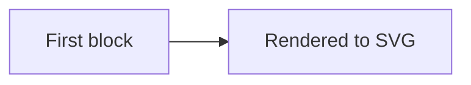

# Multi-block example

This page has more than one mermaid block. By design only the first is rendered,
so the workflow should emit a warning for the second block below.

Some explanatory text between the diagrams.

